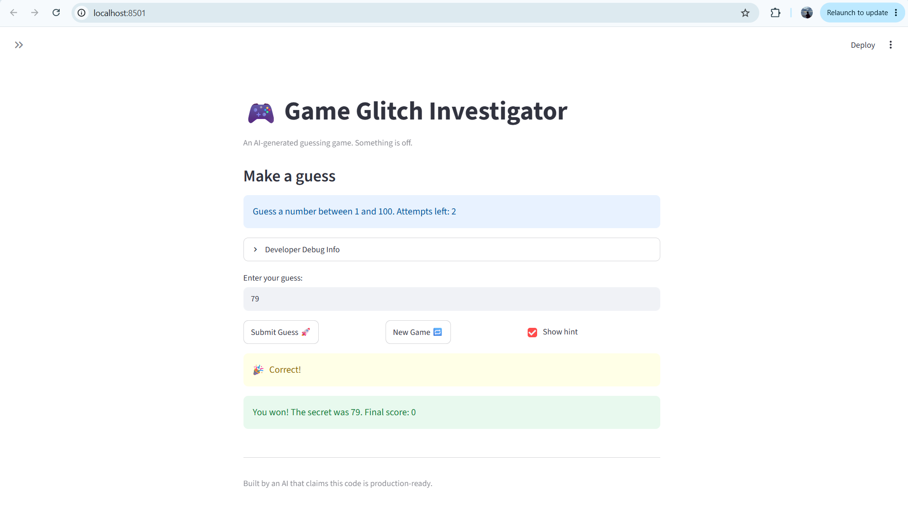

# 🎮 Game Glitch Investigator: The Impossible Guesser

## 🚨 The Situation

You asked an AI to build a simple "Number Guessing Game" using Streamlit.
It wrote the code, ran away, and now the game is unplayable. 

- You can't win.
- The hints lie to you.
- The secret number seems to have commitment issues.

## 🛠️ Setup

1. Install dependencies: `pip install -r requirements.txt`
2. Run the broken app: `python -m streamlit run app.py`

## 🕵️‍♂️ Your Mission

1. **Play the game.** Open the "Developer Debug Info" tab in the app to see the secret number. Try to win.
2. **Find the State Bug.** Why does the secret number change every time you click "Submit"? Ask ChatGPT: *"How do I keep a variable from resetting in Streamlit when I click a button?"*
3. **Fix the Logic.** The hints ("Higher/Lower") are wrong. Fix them.
4. **Refactor & Test.** - Move the logic into `logic_utils.py`.
   - Run `pytest` in your terminal.
   - Keep fixing until all tests pass!

## 📝 Document Your Experience

- [Game Purpose] The purpose of this game is to let the user guess a randomly generated secret number within a set number of attempts. The game provides hints after each guess and keeps track of the user's score throughout the game.
- [Bugs Found] 
   -The attempt counter started at 1 instead of 0.
   -Invalid inputs used an attempt even when guess was not valid.
   -Incorect hints displayed as would say "Go LOWER!" when secret number is higher and vice versa
   -Secret number could be generated outside expected range of 1 to 100.
- [Fixes Applied] 
   -Added range validation to ensure guesses stay within allowed difficulty range.
   -Fixed attempt counter so it starts at 0 and only increases after a valid guess.
   -Added tests and verified various states of game logic using pytest

## 📸 Demo Walkthrough

Describe your fixed game in numbered steps so a reader can follow along without watching a video:

1. The user starts the game and selects difficulty level from the dropdown menu in sidebar.
2. The game generates a secret number and displays the allowed range and remaining number of attempts.
3. The user enters a guess that is lower than the secret number and receives the "Go HIGHER!" hint.
4. The user enters a guess that is higher than the secret number and receives the "Go LOWER!" hint.
5. The user continues guessing until the correct number is entered within the allowed number of guesses.
6. The game displays a winning message, reveals the secret number, and shows the final score.

**Screenshot** 

## 🧪 Test Results

================================== test session starts ===================================
platform win32 -- Python 3.13.0, pytest-9.1.0, pluggy-1.6.0
rootdir: C:\Users\srikr\OneDrive\Desktop\.vscode\CodePath\ai110-module1show-gameglitchinvestigator-starter
plugins: anyio-4.13.0
collected 3 items                                                                         

tests\test_game_logic.py ...                                                        [100%]

=================================== 3 passed in 0.06s ====================================
PS C:\Users\srikr\OneDrive\Desktop\.vscode\CodePath\ai110-module1show-gameglitchinvestigator-starter> 

## 🚀 Stretch Features

- [ ] [If you choose to complete Challenge 4, describe the Enhanced UI changes here — a screenshot is optional]
